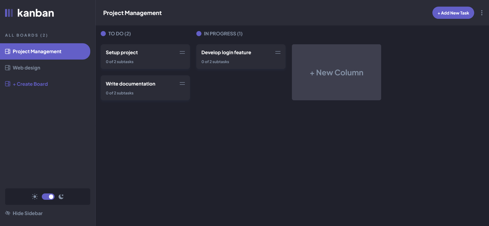
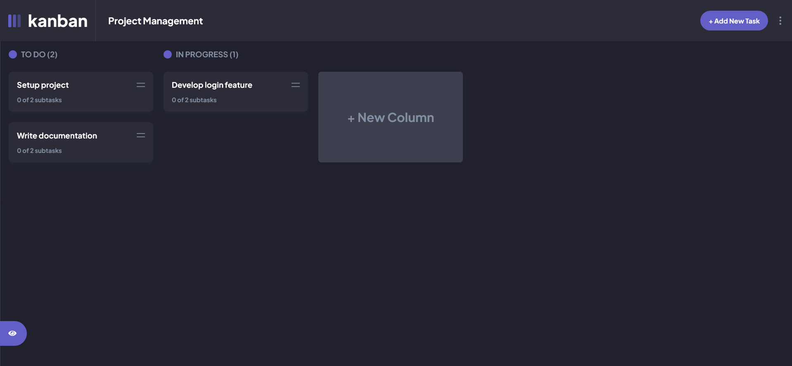
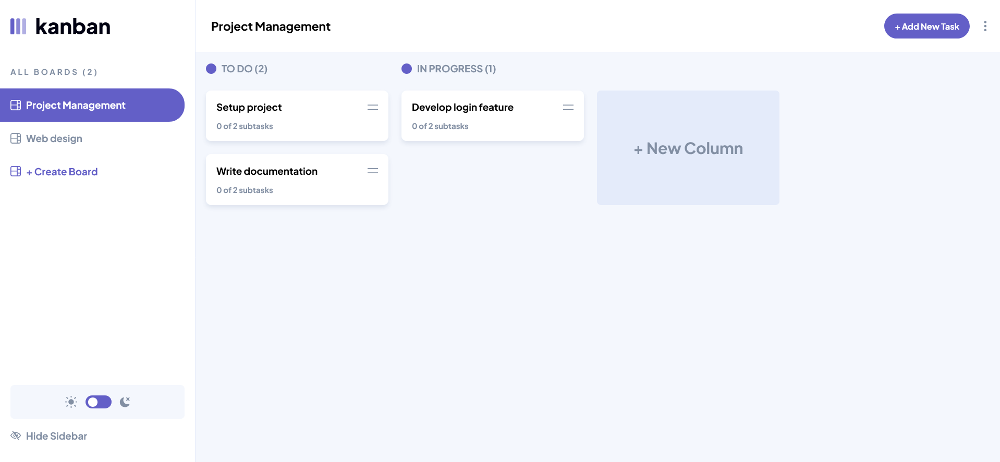

# Frontend Mentor - Kanban task management web app solution

This is a solution to the [Kanban task management web app challenge on Frontend Mentor](https://www.frontendmentor.io/challenges/kanban-task-management-web-app-wgQLt-HlbB). Frontend Mentor challenges help you improve your coding skills by building realistic projects. 

## Table of contents

- [Overview](#overview)
  - [The challenge](#the-challenge)
  - [Screenshot](#screenshot)
  - [Links](#links)
- [My process](#my-process)
  - [Built with](#built-with)
  - [What I learned](#what-i-learned)
  - [Useful resources](#useful-resources)
- [Author](#author)

## Overview

### The challenge

Users should be able to:

- View the optimal layout for the app depending on their device's screen size
- See hover states for all interactive elements on the page
- Create, read, update, and delete boards and tasks
- Receive form validations when trying to create/edit boards and tasks
- Mark subtasks as complete and move tasks between columns
- Hide/show the board sidebar
- Toggle the theme between light/dark modes

### Screenshot







### Links

- Live Site URL: [https://kanban-board-tau-dusky.vercel.app/](https://kanban-board-tau-dusky.vercel.app/)

## My process

### Built with

- Semantic HTML5 markup
- Flexbox
- CSS Grid
- Mobile-first workflow
- React
- Redux
- React Query
- DnD Kit
- Axios
- Zod
- Express
- PostgreSql
- Prisma

### What I learned

For the first time I used dialog tag in html to create modal. I learned that is so cool to use and not that hard to implement.

```js
    <dialog ref={modalRef} className="p-main bg-white dark:bg-dark-grey rounded-lg w-[315px] md:w-[480px] max-h-[calc(100vh-200px)] overflow-y-auto backdrop:bg-black/50">
        {!isModalDelete && (
            <div>
                {children}
            </div>
        )}
        {isModalDelete && (
            <div>
                {children}
                <div className="grid grid-cols-1 gap-3 md:grid-cols-2 mt-5">
                    <Button variant={"delete"} onClick={handleDelete} disabled={isPending}>Delete</Button>
                    <Button variant={"secondary"} onClick={closeModal}>Cancel</Button>
                </div>
            </div>
        )}
    </dialog>
```

### Useful resources

- [Dialog HTML element](https://www.youtube.com/watch?v=ywtkJkxJsdg&t=595s) - This helped me for understanding how dialog HTML element works.

## Author

- My website - [https://portfoliomateuszbizon.netlify.app/](https://portfoliomateuszbizon.netlify.app/)
- Frontend Mentor - [https://www.frontendmentor.io/profile/mateuszbizon](https://www.frontendmentor.io/profile/mateuszbizon)
- LinkedIn - [https://www.linkedin.com/in/mateusz-bizo%C5%84-ab5672304/](https://www.linkedin.com/in/mateusz-bizo%C5%84-ab5672304/)
